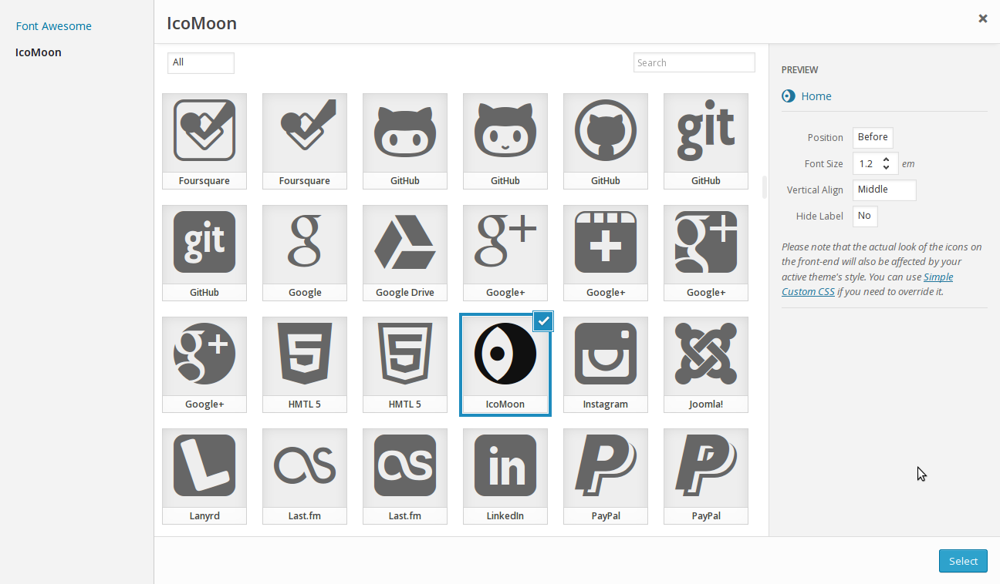

<!-- DO NOT EDIT THIS FILE; it is auto-generated from readme.txt -->
# Menu Icons: IcoMoon

IcoMoon package for Menu Icons

**Contributors:** [kucrut](http://profiles.wordpress.org/kucrut)  
**Tags:** [menu](http://wordpress.org/plugins/tags/menu), [nav-menu](http://wordpress.org/plugins/tags/nav-menu), [icons](http://wordpress.org/plugins/tags/icons), [navigation](http://wordpress.org/plugins/tags/navigation)  
**Requires at least:** 3.8  
**Tested up to:** 3.9  
**Stable tag:** 0.1.0  
**License:** [GPLv2](http://www.gnu.org/licenses/gpl-2.0.html)  
**Donate Link:** http://kucrut.org/#coffee  

## Description ##

[IcoMoon](http://icomoon.io/) package for [Menu Icons](http://wordpress.org/plugins/menu-icons/).

### Usage ###
1. After the plugin is activated, go to *Appearance* > *Menus* to edit your menus
1. Enable *IcoMoon* in "Menu Icons Settings" meta box and click the save button
1. Select icon by clicking on the "Select icon" link
1. Save the menu

## Screenshots ##

### Icon selection

## Installation ##

1. Install & activate [Menu Icons](http://wordpress.org/plugins/menu-icons/)
1. Upload `menu-icons-icomoon` to the `/wp-content/plugins/` directory
1. Activate the plugin through the *Plugins* menu in WordPress

## Other Notes ##

Originally, the icon classes are prefixed with `icon-`. I think it's too common so I've changed it to `icomoon-` to avoid conflicts with other elements.

## Changelog ##

### 0.1.0 ###
* Initial release

